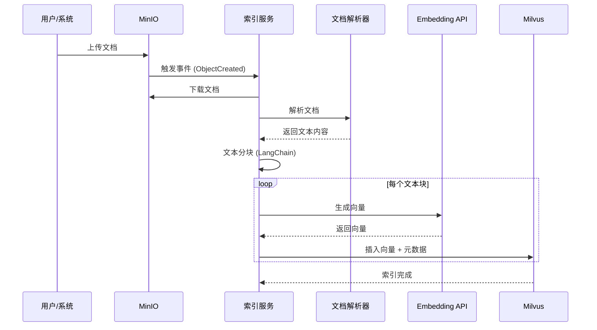
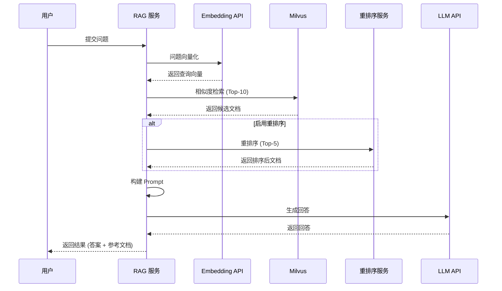

# 系统架构设计文档

## 📐 系统架构概览

### 分层架构

```
┌─────────────────────────────────────────────────────────────┐
│                    应用层 (Application Layer)                │
│  ┌──────────────┐  ┌──────────────┐                        │
│  │  Web 问答页  │  │  管理后台    │                        │
│  └──────────────┘  └──────────────┘                        │
└─────────────────────────────────────────────────────────────┘
                            ↓ HTTP/API
┌─────────────────────────────────────────────────────────────┐
│                   业务逻辑层 (Business Layer)                │
│  ┌──────────────────────────────────────────────────────┐   │
│  │  RAGService                                         │   │
│  │  • query_service() - 核心查询服务                   │   │
│  │  • 向量检索 + 重排序 + LLM 生成                      │   │
│  └──────────────────────────────────────────────────────┘   │
│  ┌──────────────────────────────────────────────────────┐   │
│  │  RerankService                                      │   │
│  │  • 多提供商支持（阿里百炼/硅基流动）                 │   │
│  └──────────────────────────────────────────────────────┘   │
└─────────────────────────────────────────────────────────────┘
                            ↓
┌─────────────────────────────────────────────────────────────┐
│                   数据访问层 (Data Access Layer)              │
│  ┌──────────────┐              ┌──────────────┐            │
│  │  MilvusAPI   │              │  MinIO Client│            │
│  │  • 向量检索   │              │  • 文档存储   │            │
│  │  • 索引管理   │              │  • 事件监听   │            │
│  └──────────────┘              └──────────────┘            │
└─────────────────────────────────────────────────────────────┘
                            ↓
┌─────────────────────────────────────────────────────────────┐
│                   数据存储层 (Storage Layer)                 │
│  ┌──────────────┐              ┌──────────────┐            │
│  │   Milvus     │              │   MinIO     │            │
│  │  (向量数据库) │              │ (对象存储)  │            │
│  └──────────────┘              └──────────────┘            │
└─────────────────────────────────────────────────────────────┘
```

---

## 🔄 核心流程设计

### 1. 文档索引流程



**关键步骤说明**：

1. **文档上传**：用户通过管理后台或直接上传到 MinIO
2. **事件触发**：MinIO 发送 `s3:ObjectCreated:Put` 事件
3. **文档解析**：根据文件类型选择解析器（PDF/Office/Markdown/Text）
4. **文本分块**：使用 LangChain 的 `RecursiveCharacterTextSplitter`
   - 默认分块大小：2048 字符
   - 重叠大小：128 字符
5. **向量化**：调用 Embedding API 生成向量
6. **存储索引**：将向量和元数据存储到 Milvus

### 2. RAG 问答流程



**关键步骤说明**：

1. **问题向量化**：将用户问题转换为向量
2. **向量检索**：在 Milvus 中搜索相似文档（Top-10）
3. **重排序**（可选）：使用重排序服务优化结果（Top-5）
4. **上下文构建**：将检索到的文档拼接成 Prompt
5. **LLM 生成**：调用 LLM API 生成回答
6. **结果返回**：返回答案、参考文档、Token 使用情况

---

## 🗄️ 数据模型设计

### Milvus Collection Schema

```python
collection_name: "mildoc_collection"

fields:
  - id (INT64, Primary Key, Auto ID)
  - doc_name (VARCHAR, max_length=500)          # 文档名称
  - doc_path_name (VARCHAR, max_length=1000)    # 文档路径
  - doc_type (VARCHAR, max_length=50)           # 文档类型
  - doc_md5 (VARCHAR, max_length=32)            # 文档 MD5
  - doc_length (INT64)                         # 文档大小（字节）
  - content (VARCHAR, max_length=65535)        # 文本内容
  - content_vector (FLOAT_VECTOR, dim=1536)    # 向量（索引字段）
  - embedding_model (VARCHAR, max_length=100)  # Embedding 模型名称

index:
  - field_name: content_vector
  - index_type: IVF_FLAT
  - metric_type: COSINE
  - params: {"nlist": 1024}
```

### 文档解析结果模型

```python
{
    "doc_name": "example.pdf",                    # 文档名称
    "doc_path_name": "documents/example.pdf",     # 文档路径
    "doc_type": "pdf",                            # 文档类型
    "doc_md5": "abc123...",                       # MD5 哈希值
    "doc_length": 1048576,                        # 文档大小
    "contents": [                                 # 文本片段列表
        "这是第一个文本片段...",
        "...第二个片段...",
        ...
    ]
}
```

### RAG 响应模型

```python
RAGResponse:
  - content: str                    # LLM 生成的回答
  - source_documents: List[SourceDocument]  # 参考文档列表
  - token_usage: TokenUsage         # Token 使用情况
  - success: bool                   # 是否成功
  - error_message: Optional[str]    # 错误信息

SourceDocument:
  - doc_name: str                   # 文档名称
  - doc_path_name: str              # 文档路径
  - doc_type: str                   # 文档类型
  - content_preview: str            # 内容预览
  - similarity_score: float         # 相似度分数

TokenUsage:
  - prompt_tokens: int              # 输入 Token 数
  - completion_tokens: int          # 输出 Token 数
  - total_tokens: int               # 总 Token 数
```

---

## 🔧 组件设计

### 1. 文档解析器架构

```
SimpleObjectParser (统一入口)
    ├── OfficeParser (markitdown)
    │   ├── Word (.docx)
    │   ├── Excel (.xlsx)
    │   └── PowerPoint (.pptx)
    ├── PDFParser (PyPDF2)
    ├── MarkdownParser
    └── TextParser (兜底)
```

**设计模式**：策略模式（Strategy Pattern）
- 每个解析器实现统一的 `DocumentParser` 接口
- 根据文件类型自动选择解析器
- 支持扩展新的解析器

### 2. RAG 服务架构

```
RAGService
    ├── Embeddings (自定义 Embedding 类)
    ├── VectorStore (LangChain Milvus)
    ├── LLM (ChatOpenAI)
    └── RerankService (可选)
```

**设计模式**：单例模式（Singleton Pattern）
- 全局唯一 RAG 服务实例
- 延迟初始化，首次使用时创建
- 线程安全

### 3. 索引服务架构

```
MinioEventListener
    ├── SimpleObjectParser
    ├── EmbeddingTool
    └── MilvusAPI
```

**运行模式**：
- **全量刷新**：遍历所有文档，强制更新
- **排查补漏**：只处理缺失的文档
- **增量监听**：实时监听 MinIO 事件

---

## 🔐 安全设计

### 1. 配置管理

- **环境变量**：敏感信息通过 `.env` 文件管理
- **密钥隔离**：API Key、密码等不硬编码
- **配置验证**：启动时验证必要配置项

### 2. 访问控制

- **管理后台**：基于 Session 的登录验证
- **API 接口**：可扩展 Token 认证
- **数据库**：Milvus 用户名密码认证

### 3. 数据安全

- **MD5 校验**：确保文档完整性
- **去重机制**：避免重复处理
- **错误处理**：不泄露敏感信息

---

## 📈 性能优化

### 1. 索引优化

- **批量插入**：支持批量插入到 Milvus
- **异步处理**：增量更新使用异步线程
- **索引参数**：优化 IVF_FLAT 索引参数（nlist=1024, nprobe=64）

### 2. 检索优化

- **向量索引**：使用 IVF_FLAT 索引加速检索
- **重排序优化**：只对 Top-10 进行重排序，减少计算量
- **结果缓存**：可扩展结果缓存机制

### 3. 资源管理

- **连接池**：复用数据库连接
- **内存管理**：限制内存缓存大小
- **超时控制**：API 调用设置超时时间

---

## 🧪 测试策略

### 1. 单元测试

- **文档解析器**：测试各种文档格式解析
- **向量检索**：测试相似度搜索准确性
- **RAG 服务**：测试查询流程

### 2. 集成测试

- **端到端流程**：文档上传 → 索引 → 查询
- **增量更新**：测试事件监听和增量处理
- **错误处理**：测试异常情况处理

### 3. 性能测试

- **索引性能**：测试大批量文档索引速度
- **检索性能**：测试查询响应时间
- **并发测试**：测试多用户并发查询

---

## 🚀 部署架构

### 推荐部署方案

```
┌─────────────────────────────────────────┐
│         负载均衡器 (Nginx)               │
└─────────────────────────────────────────┘
            ↓
┌─────────────────────────────────────────┐
│     应用服务器 (多实例)                  │
│  ┌──────────┐  ┌──────────┐            │
│  │ RAG 服务 │  │ 管理后台 │            │
│  └──────────┘  └──────────┘            │
└─────────────────────────────────────────┘
            ↓
┌─────────────────────────────────────────┐
│     数据存储层                          │
│  ┌──────────┐  ┌──────────┐            │
│  │  Milvus  │  │  MinIO   │            │
│  │ (集群)    │  │ (集群)   │            │
│  └──────────┘  └──────────┘            │
└─────────────────────────────────────────┘
```

### 容器化部署

- **Docker Compose**：一键部署所有服务
- **Kubernetes**：支持 K8s 部署（规划中）
- **环境隔离**：开发/测试/生产环境隔离

---

## 📝 扩展性设计

### 1. 水平扩展

- **无状态服务**：RAG 服务和管理后台可水平扩展
- **数据分片**：Milvus 支持数据分片
- **负载均衡**：支持多实例负载均衡

### 2. 功能扩展

- **多解析器**：支持添加新的文档解析器
- **多模型**：支持切换不同的 Embedding/LLM 模型
- **多存储**：支持不同的存储后端（OSS、S3 等）

### 3. 集成扩展

- **API 接口**：提供 RESTful API 供第三方集成
- **Webhook**：支持 Webhook 通知
- **插件系统**：支持插件化扩展（规划中）

---

## 🔍 监控与日志

### 1. 日志系统

- **结构化日志**：使用 Python logging 模块
- **日志级别**：DEBUG、INFO、WARNING、ERROR
- **日志轮转**：支持日志文件轮转

### 2. 监控指标

- **性能指标**：查询响应时间、索引速度
- **资源指标**：CPU、内存、磁盘使用率
- **业务指标**：查询次数、文档数量、Token 消耗

### 3. 健康检查

- **服务健康**：提供 `/health` 接口
- **组件检查**：检查 Milvus、MinIO、API 连接状态
- **自动恢复**：支持自动重连和恢复

---

## 📚 参考资料

- [LangChain 文档](https://python.langchain.com/)
- [Milvus 文档](https://milvus.io/docs)
- [MinIO 文档](https://min.io/docs)
- [OpenAI API 文档](https://platform.openai.com/docs)

---

**最后更新**：2025-01-XX

